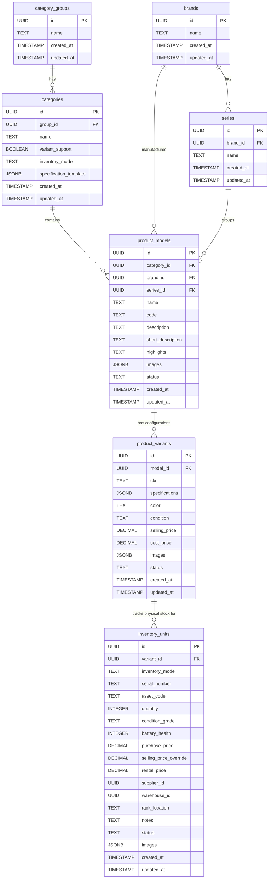

# Product Schema ER Diagram

Below is the Entity-Relationship (ER) diagram representing the Klarone Product Module database schema. It illustrates the hierarchical relationship from high-level categories and brands down to physical inventory units.

### Key Highlights
- **Product Models** act as the central anchor, tying together Categories, Brands, and optional Series.
- **Dynamic Configuration** is supported natively via the `specifications` JSONB column on the `product_variants` table.
- **Inventory Tracking** is strict: `inventory_units` MUST map directly to a `product_variant`. For products that do not use variants, a Default Variant is generated.
- **Stock Types** are governed by `inventory_mode`, dictating if a unit tracks an individual `serial_number` (like a laptop) or just an aggregate `quantity` (like cables).
